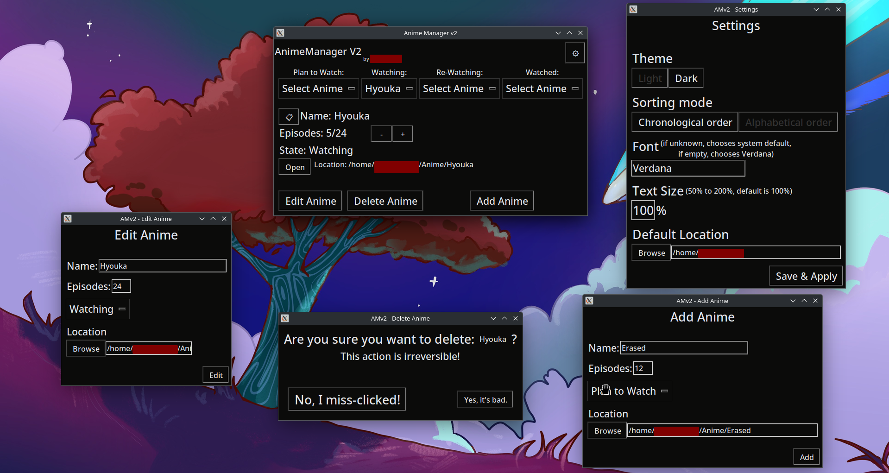

# AnimeManager V2.0
> Clouds are for Rain.\
> <sub>\-[Louis Rossmann](https://odysee.com/@rossmanngroup)</sub>

---





AnimeManager is like [MyAnimeList](https://myanimelist.net) but locally hosted and cooler. It's written in Python and uses TkInter for the GUI.

To use it, either download the [compiled version](#1-using-the-compiled-version) or use the [python source](#2-using-the-python-source).

### ToDo
- [X] Make the database a single file instead of one file per list.
- [X] Make an easily configurable GUI.
- [X] Add a 'Location' part to access the anime in a single click.
- [X] Make the Location part work both for links and for folder locations.
- [ ] Add a thumbnail of the anime from AniDB.

There are four lists:
|List         |What it represents                                           |
|:-----------:|:------------------------------------------------------------|
|Plan-To-Watch|Has every anime you haven't watched yet, but are planning to.|
|Watching     |Has every anime you are currently watching.                  |
|Re-Watching  |Has every anime you already finished, but are watching again |
|Watched      |Has every anime you have finished watching.                  |

*Note: These are subjective ideas of what each list represents. You're free to do whatever you want.*

## Download
There are 2 ways to download and use AnimeManager V2.0
### 1. Using the [compiled version](https://github.com/maxnrt/TD1R103/releases/latest).
Although AnimeManager V2.0 is written in Python, I've used PyInstaller to compile it for Windows and Linux.
That way, you don't even need Python to be installed to use it.

**Note: This is NOT the way I recommend anyone to use it.**

There are two versions of the compiled executable.
* The Single-File
* The Folder.

The Single-File is much more practical to work with. Place it anywhere, and you have AnimeManager with only a few text files created next to it.
The Folder however is much more efficient. It starts faster and lags less, though you need to reserve an entire folder to it, and the folder is pretty messy.

#### Single File
1. Download the ZIP file in the [Releases Tab](https://github.com/maxnrt/MarkDown-Tests/releases).
2. Unzip the ZIP file into where you want AnimeManager to reside.
3. Execute AnimeManagerV2.exe (on Windows) or AnimeManagerV2 (on Linux)

*Note: You might have to render AnimeManager executable on Linux. If so, use the following command:*
```bash
$ chmod +x /path/to/AnimeManagerV2
```

#### Folder
1. Download the ZIP file in the [Releases Tab](https://github.com/maxnrt/MarkDown-Tests/releases)
2. Unzip the ZIPped folder into where you want the AnimeManager folder to reside.
3. Open the AnimeManager folder.
4. Look for and execute AnimeManagerV2.exe (on Windows) or type the following in the terminal (on Linux):
```bash
$ chmod +x AnimeManagerV2
$ ./AnimeManagerV2
```
*Note: on Linux, I recommend setting up an alias to AnimeManager so you can execute it from anywhere in your system:*
###### Setting up an alias
1. Open ~/.bashrc
2. Add `alias anm='/absolute/path/to/AnimeManagerV2'` to it.
3. Type `$ source ~/.bashrc` to update the changes or restart your terminal.

### 2. Using the python source.
**Note: This way of doing it is much better since you can verify the source and make sure no malware is present.** \
*<sub>(Not that I have any in my compiled version lmao)</sub>*
##### Windows
1. Download the Git Repo in a ZIP file.
2. Extract the ZIP file.
3. Execute `pip -r requirements.txt` in a cmd or powershell.
4. Start AnimeManagerV2.py

##### Linux
1. Clone the Git Repo and `cd` into it
2. Execute `pip3 -r requirements.txt` in the terminal.
3. Then use `python3 AnimeManager.py` to start it.
4. Optional: setup an [alias](#setting-up-an-alias).
